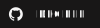

<!--Start-->

</img>

# Decibel

Minecraft resource pack adding a variety of high-quality music to compliment any situation. 1.7.2-1.21.7 support!

Decibel is a resource pack that adds a variety of high-quality music for Minecraft 1.7.2-1.21.7. With a wide selection of pre-made packages to choose from, Decibel offers a solution for nearly any scenario. New releases soon!

<!--Download-->
## Download

<!--Credits-->
## Credits

<ul>
    <li>Decibel logo: <a href="https://game-icons.net">game-icons.net</a> (by <a href="https://game-icons.net/">Skoll</a> under <a href="https://creativecommons.org/licenses/by/3.0/">CC BY 3.0</a>)</li>
    <li>Read the Wiki icon: <a href="https://www.iconfinder.com/icons/8664950/book_education_icon">iconfinder.com</a> (under <a href="https://creativecommons.org/licenses/by/4.0/">CC BY 4.0</a>)</li>
    <li>Bug Report icon: <a href="https://www.iconfinder.com/icons/9104219/warning_danger_attention_caution_alert_icon">iconfinder.com</a> (under <a href="https://creativecommons.org/licenses/by/4.0/">CC BY 4.0</a>)</li>
    <li>Music Credits icon: <a href="https://www.iconfinder.com/icons/9040475/list_ul_icon">iconfinder.com</a> (under <a href="https://opensource.org/license/MIT">The MIT License</a>)</li>
    <li>Badges: <a href="https://shields.io/">shields.io</a> (under <a href="https://creativecommons.org/publicdomain/zero/1.0/deed">CC0 1.0</a>)</li>
</ul>